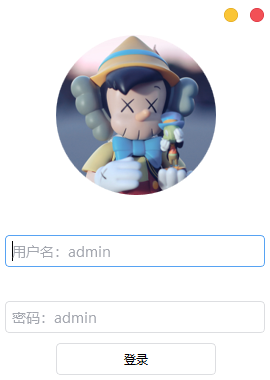
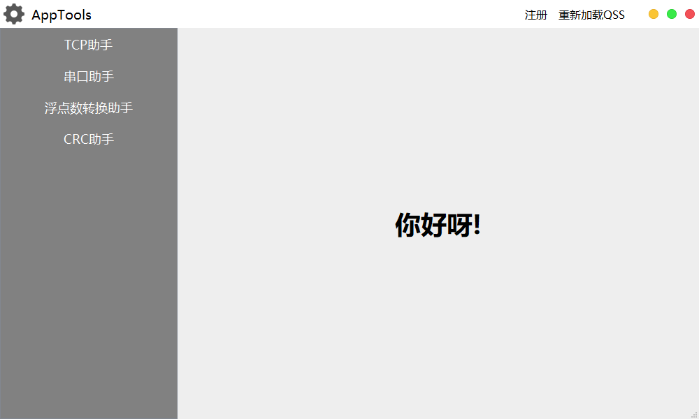
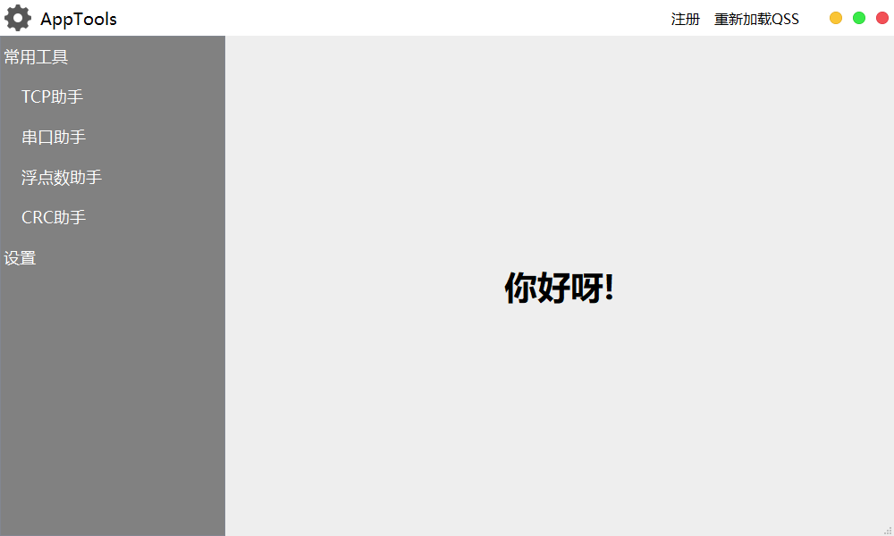

# AppTools
QT的一套UI模板以及一些小工具合集

1. 编译构建后
2. 把`源码 bin 目录下的所有文件`复制到编译出来的可执行文件所在目录，覆盖`bin`；
3. 将`/bin/sql`目录下的[AppTools.sql](AppTools/bin/sql/AppTools.sql)导入MySql数据库；

程序内部配置，可根据实际情况修改[LoginWidget.cpp](AppTools/ui/LoginWidget.cpp)的`on_loginbtn_clicked()`函数

    1. MySql db("127.0.0.1",3306,"apptools","root","root");

然后运行

先显示
## 登录界面 ##

用户名和密码均为`admin`

登陆成功显示主界面`你好呀！

> 考虑到之后可能会有许多按钮,于是又写了树形按钮结构的代码
> 
> 更改界面显示的代码如下，在[mainwindow.cpp](AppTools/ui/mainwindow.cpp)文件的`构造`函数里

    1. //QListWidget
    2. ui->listWidget->hide();
    3. //initListWidget();
    4. 
    5. //QTreeWidget
    6. //ui->treeWidget->hide();
    7. initTreeWidget();

## 界面1： ##

## 界面2： ##
